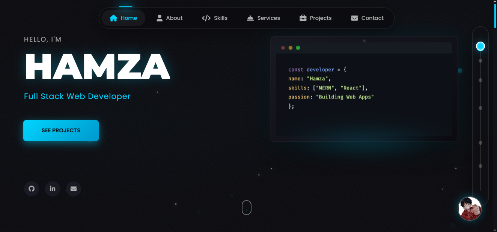

# Hamza | Full Stack Web Developer Portfolio

A highly interactive, dark-themed, premium developer portfolio. Designed with a cyber/hacker aesthetic, it features 3D flipping transitions, a fully functioning command-line interface, cinematic GSAP animations, a built-in chatbot, and seamless responsiveness across all device sizes.

## 🌟 Key Features

- **Interactive Terminal:** A fully functional GUI terminal that processes commands (`help`, `clear`, `github`, `linkedin`, `email`) and seamlessly flips into a simple contact form.
- **Cinematic Animations:** Powered by **GSAP** and **ScrollTrigger**, featuring smooth entrance animations, floating cards, text typing sequences, and gradient flows.
- **Lenis Smooth Scroll:** Buttery-smooth scrolling experience bypassing native browser jank.
- **3D Card Flips:** Project cards flip to reveal intricate details, live/repo links, and specialized warnings.
- **Custom Project Modals:** Deep-dive modal popups that allow users to toggle between desktop and mobile screenshot views.
- **Luffy Chatbot:** Built-in floating chat interface widget mapped to the DOM.
- **Tubelight Navbar:** A glowing top-nav that animates actively to your scrolled position.
- **Custom Scroll Track:** A side-dock tracking mechanism acting as a secondary visual navigator.

## 🛠️ Built With

This project relies on the power of modern vanilla web standards with no heavy front-end compile frameworks.

* **Frontend:** HTML5, CSS3 (Variables, Grid, Flexbox, 3D Transforms), Vanilla JavaScript (ES6+)
* **Animation & Motion:** [GSAP (GreenSock)](https://gsap.com/) (Core, ScrollTrigger, TextPlugin, ScrollToPlugin)
* **Smooth Scrolling:** [Lenis](https://studiofreight.github.io/lenis/)
* **Typography & Icons:** Google Fonts (Montserrat, Poppins, Fira Code), FontAwesome 6.5.1
* **Contact Form Engine:** [Web3Forms](https://web3forms.com/) (Backend-less email transmissions)

## 🚀 Getting Started

Since this project avoids heavy build tools and dependency compilers, getting it running locally is instantaneous.

### Prerequisites

All you need is a modern web browser (Chrome, Edge, Firefox, Safari).

### Usage

1. Clone or download the repository.
2. Navigate to the project directory.
3. Open `index.html` directly in your browser.

*Alternative Setup (For Live Server Extension in VS Code):*
1. Right-click on `index.html`.
2. Select **Open with Live Server**.

## 📨 Contact Form Configuration

The terminal contact form is powered by Web3Forms.
To receive emails to your own inbox:
1. Generate an Access Key at [Web3Forms Console](https://web3forms.com/).
2. Open `index.html`.
3. Locate the hidden `access_key` input inside the `#portfolio-contact-form`.
4. Replace the `value` with your generated key.

## 👨‍💻 Author

**Hamza**
- GitHub: [@orewahamza](https://github.com/orewahamza)
- LinkedIn: [Hamza Mirza](https://www.linkedin.com/in/hamza-mirza-dev)

---
*If you like this portfolio, don't forget to leave a star on the repository!*
